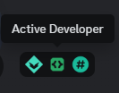

# Active Developer Badge Bot

🇺🇸 EN | [🇷🇺 RU](README.ru.md)

Discord bot that will help you get Active Developer Badge.  

## Requirements
- Python >= 3.9
- pip (Python package installer)
- Discord bot & Discord server with `Community` feature (we'll create them in this guide)

## Guide
1. Clone or download this repository.
2. Install required dependencies:
    - Windows: `python -m pip install -r requirements.txt`
    - Linux: `python3 -m pip install -r requirements.txt`
3. Create Discord bot:
    1. Go to [Discord Developer Portal](https://discord.com/developers/applications) and click `New Application` in the upper right corner.
    2. Write a name of the bot. I'll name it `ActDevBadge`.
    3. Click `Create`.  
    
    4. Go to `Bot` and click `Reset Token`. Make sure you have `Public Bot` enabled.
    5. Copy the new bot token.  
    ⚠️ **DO NOT SHARE BOT TOKEN WITH ANYONE. IT MIGHT BE VERY DANGEROUS!**  
    
    6. Paste token in the code:  
    
    7. Save the file.
4. Make a server with `Community` feature:
    1. Create a regular Discord server.  
    
    2. Open server settings, click `Enable Community` and click `Get Started`.
    3. Finish setup.
    4. Close server settings.
5. Run the bot:
    - Windows: `python main.py`
    - Linux: `python3 main.py`  

6. Open the invite link in browser and invite the bot to the created server.  

7. Go to server and use the `/hello` command.  

8. Wait ~24 hours and go to [Developer Portal](https://discord.com/developers/active-developer).

9. Select your bot, server and `general` channel.

10. Claim your badge!