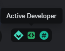
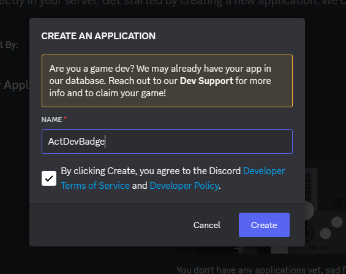
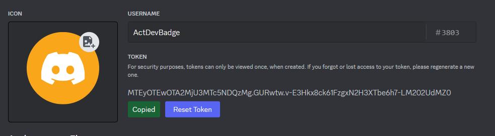
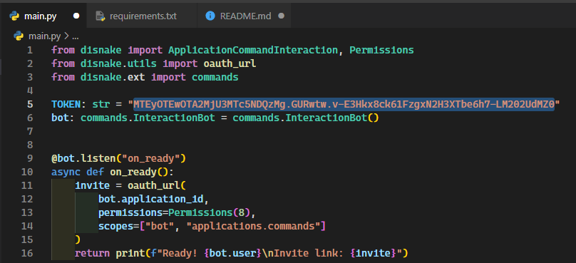
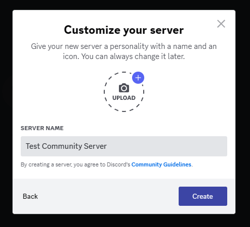
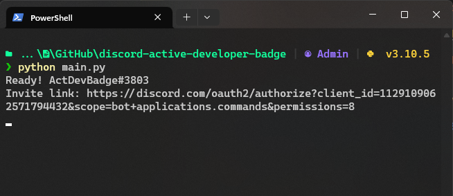
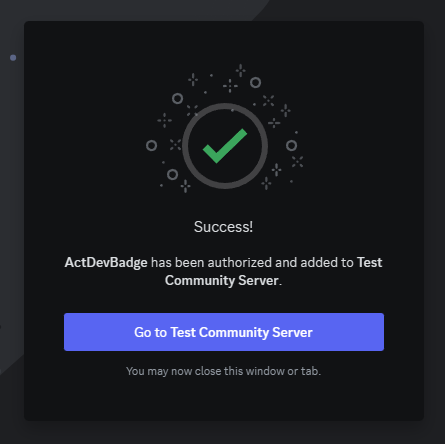
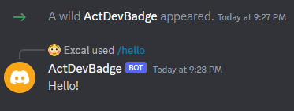

# Active Developer Badge Bot

[🇺🇸 EN](README.md) | 🇷🇺 RU

Discord бот который поможет вам получить значок активного разработчика.  

## Требования
- Python >= 3.9
- pip (Установщик пакетов Python)
- Discord бот & Discord сервер с режимом сообщества (мы создадим их в этом гайде)

## Гайд
1. Клонируйте или скачайте этот репозиторий.
2. Установите необходимые зависимости:
    - Windows: `python -m pip install -r requirements.txt`
    - Linux: `python3 -m pip install -r requirements.txt`
3. Создайте Discord бота:
    1. Перейдите в [портал разработчика Discord](https://discord.com/developers/applications) и нажмите `New Application` в правом верхнем углу.
    2. Напишите имя бота. Я назову его `ActDevBadge`.
    3. Нажмите `Create`.  
    
    4. Перейдите в `Bot` и нажмите `Reset Token`. Убедитесь, что у вас включен `Public Bot`.
    5. Скопируйте новый токен бота.  
    ⚠️ **НЕ ДЕЛИТЕСЬ ТОКЕНОМ БОТА НИ С КЕМ. ЭТО МОЖЕТ БЫТЬ ОЧЕНЬ ОПАСНО!**  
    
    6. Вставьте токен в код:  
    
    7. Сохраните файл.
4. Создайте сервер с режимом сообщества:
    1. Создайте обычный Discord сервер.  
    
    2. Откройте настройки сервера, нажмите `Включить сообщество` и нажмите `Начать`.
    3. Закончите настройку.
    4. Закройте настройки сервера.
5. Запустите бота:
    - Windows: `python main.py`
    - Linux: `python3 main.py`  

6. Откройте ссылку-приглашение в браузере и пригласите бота на созданный сервер.  

7. Перейдите на сервер и используйте команду `/hello`.  

8. Подождите примерно 24 часа и перейдите в [портал разработчика](https://discord.com/developers/active-developer).

9. Выберите вашего бота, сервер и канал `основной`.

10. Получите значок!